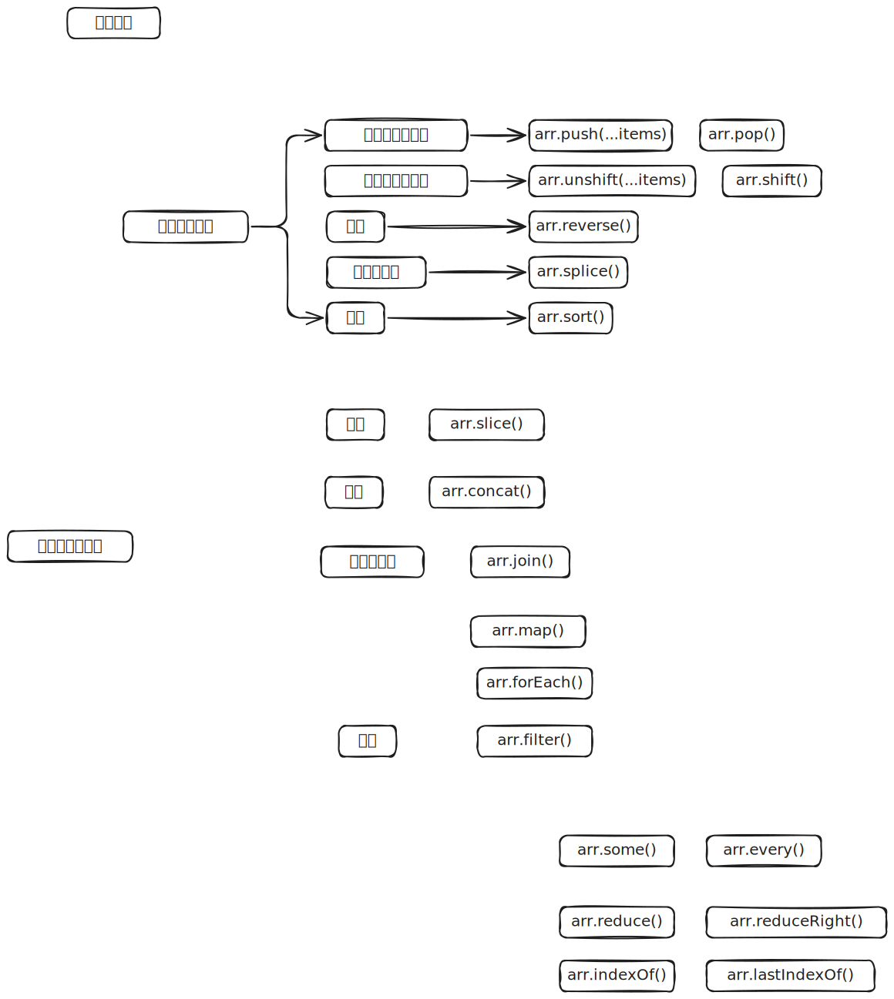

# Array 对象



## 实例方法

### splice()

`splice()` 方法用于删除原数组的一部分成员，并可以在删除的位置添加新的数组成员，返回值是被删除的元素。注意，该方法会改变原数组

```js
arr.splice(start, count, addElement1, addElement2, ...);
```

`splice` 的第一个参数是删除的起始位置（从 0 开始），第二个参数是被删除的元素个数。如果后面还有更多的参数，则表示这些就是要被插入数组的新元素

```js
var a = ["a", "b", "c", "d", "e", "f"];
a.splice(4, 2); // ["e", "f"]
a; // ["a", "b", "c", "d"]
```

除了删除成员，还可以插入新成员

```js
var a = ["a", "b", "c", "d", "e", "f"];
a.splice(4, 2, 1, 2); // ["e", "f"]
a; // ["a", "b", "c", "d", 1, 2]
```

起始位置如果是负数，就表示从倒数位置开始删除

```js
var a = ["a", "b", "c", "d", "e", "f"];
a.splice(-4, 2); // ["c", "d"]
```

如果只是单纯地插入元素，`splice` 方法的第二个参数可以设为 `0`

```js
var a = [1, 1, 1];

a.splice(1, 0, 2); // []
a; // [1, 2, 1, 1]
```

如果只提供第一个参数，等同于将原数组在指定位置拆分成两个数组。

```js
var a = [1, 2, 3, 4];
a.splice(2); // [3, 4]
a; // [1, 2]
```

### reduce()，reduceRight()

`reduce()` 方法和 `reduceRight()` 方法依次处理数组的每个成员，最终累计为一个值。它们的差别是，`reduce()` 是从左到右处理（从第一个成员到最后一个成员），`reduceRight()` 则是从右到左（从最后一个成员到第一个成员），其他完全一样

```js
[1, 2, 3, 4, 5].reduce(function (a, b) {
  console.log(a, b);
  return a + b;
});
// 1 2
// 3 3
// 6 4
// 10 5
//最后结果：15
```

上面代码中，`reduce()` 方法用来求出数组所有成员的和。`reduce()` 的参数是一个函数，数组每个成员都会依次执行这个函数。如果数组有 n 个成员，这个参数函数就会执行 n - 1 次

- 第一次执行：`a` 是数组的第一个成员 `1`，`b` 是数组的第二个成员 `2`
- 第二次执行：`a` 为上一轮的返回值 `3`，`b` 为第三个成员 `3`
- 第三次执行：`a` 为上一轮的返回值 `6`，`b` 为第四个成员 `4`
- 第四次执行：`a` 为上一轮返回值 `10`，`b` 为第五个成员 `5`。至此所有成员遍历完成，整个方法的返回值就是最后一轮的返回值 `15`

这四个参数之中，只有前两个是必须的，后两个则是可选的

```js
[1, 2, 3, 4, 5].reduce(function (
  a,   // 累积变量，必须
  b,   // 当前变量，必须
  i,   // 当前位置，可选
  arr  // 原数组，可选
) {
  // ... ...
```

如果要对累积变量指定初值，可以把它放在 `reduce()` 方法和 `reduceRight()` 方法的第二个参数

```js
[1, 2, 3, 4, 5].reduce(function (a, b) {
  return a + b;
}, 10);
// 25
```

建议总是加上第二个参数，这样比较符合直觉，每个数组成员都会依次执行 `reduce()` 方法的参数函数。另外，第二个参数可以防止空数组报错

```js
function add(prev, cur) {
  return prev + cur;
}

[].reduce(add)
// TypeError: Reduce of empty array with no initial value
[].reduce(add, 1)
// 1
```

下面是一个 `reduceRight()` 方法的例子

```js
function subtract(prev, cur) {
  return prev - cur;
}

[3, 2, 1]
  .reduce(subtract) // 0
  [(3, 2, 1)].reduceRight(subtract); // -4
```
