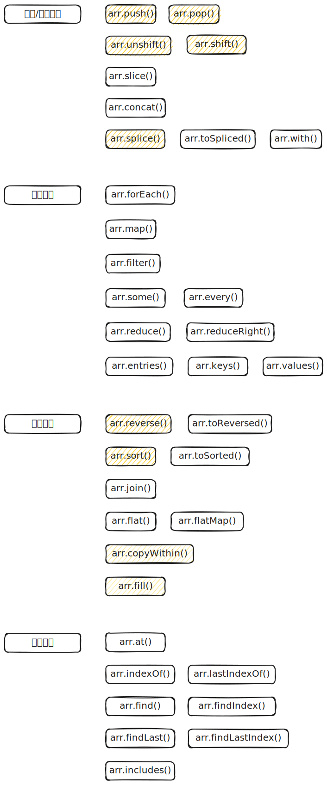

# Array 对象



## 静态方法

### Array.isArray()

`Array.isArray` 方法返回一个布尔值，表示参数是否为数组。它可以弥补 `typeof` 运算符的不足。

```js
var arr = [1, 2, 3];

typeof arr; // "object"
Array.isArray(arr); // true
```

### Array.from()

`Array.from()` 方法用于将两类对象转为真正的数组：类似数组的对象（array-like object）和可遍历（iterable）的对象（包括 ES6 新增的数据结构 Set 和 Map）。

下面是一个类似数组的对象，`Array.from()` 将它转为真正的数组。

```js
let arrayLike = {
  0: "a",
  1: "b",
  2: "c",
  length: 3,
};

// ES5 的写法
var arr1 = [].slice.call(arrayLike); // ['a', 'b', 'c']

// ES6 的写法
let arr2 = Array.from(arrayLike); // ['a', 'b', 'c']
```

实际应用中，常见的类似数组的对象是 DOM 操作返回的 NodeList 集合，以及函数内部的 `arguments` 对象。`Array.from()` 都可以将它们转为真正的数组。

```js
// NodeList 对象
let ps = document.querySelectorAll("p");
Array.from(ps).filter((p) => {
  return p.textContent.length > 100;
});

// arguments 对象
function foo() {
  var args = Array.from(arguments);
  // ...
}
```

只要是部署了 Iterator 接口的数据结构，`Array.from()` 都能将其转为数组。

```js
Array.from("hello");
// ['h', 'e', 'l', 'l', 'o']

let namesSet = new Set(["a", "b"]);
Array.from(namesSet); // ['a', 'b']
```

如果参数是一个真正的数组，`Array.from()` 会返回一个一模一样的新数组。

```js
Array.from([1, 2, 3]);
// [1, 2, 3]
```

`Array.from()` 还可以接受一个函数作为第二个参数，作用类似于数组的 `map()` 方法，用来对每个元素进行处理，将处理后的值放入返回的数组。

```js
Array.from(arrayLike, (x) => x * x);
// 等同于
Array.from(arrayLike).map((x) => x * x);

Array.from([1, 2, 3], (x) => x * x);
// [1, 4, 9]
```

如果 `map()` 函数里面用到了 `this` 关键字，还可以传入 `Array.from()` 的第三个参数，用来绑定 `this`。

### Array.of()

`Array.of()` 方法用于将一组值，转换为数组。

```js
Array.of(3, 11, 8); // [3,11,8]
Array.of(3); // [3]
Array.of(3).length; // 1
```

这个方法的主要目的，是弥补数组构造函数 `Array()` 的不足。因为参数个数的不同，会导致 `Array()` 的行为有差异。

```js
Array(); // []
Array(3); // [, , ,]
Array(3, 11, 8); // [3, 11, 8]
```

`Array.of()` 基本上可以用来替代 `Array()` 或 `new Array()`，并且不存在由于参数不同而导致的重载。它的行为非常统一。

```javascript
Array.of(); // []
Array.of(undefined); // [undefined]
Array.of(1); // [1]
Array.of(1, 2); // [1, 2]
```

`Array.of()` 方法可以用下面的代码模拟实现。

```javascript
function ArrayOf() {
  return [].slice.call(arguments);
}
```

## 实例方法

### push()，pop()

`push` 方法用于在数组的末端添加一个或多个元素，并返回添加新元素后的数组长度。注意，该方法会改变原数组。

```js
var arr = [];

arr.push(1); // 1
arr.push("a"); // 2
arr.push(true, {}); // 4
arr; // [1, 'a', true, {}]
```

`pop` 方法用于删除数组的最后一个元素，并返回该元素。注意，该方法会改变原数组。

```js
var arr = ["a", "b", "c"];

arr.pop(); // 'c'
arr; // ['a', 'b']
```

对空数组使用 `pop` 方法，不会报错，而是返回 `undefined`。

```js
[].pop(); // undefined
```

`push` 和 `pop` 结合使用，就构成了“后进先出”的栈结构（stack）。

### shift()，unshift()

`shift()` 方法用于删除数组的第一个元素，并返回该元素。注意，该方法会改变原数组。

```js
var a = ["a", "b", "c"];

a.shift(); // 'a'
a; // ['b', 'c']
```

`push()` 和 `shift()` 结合使用，就构成了“先进先出”的队列结构（queue）。

`unshift()` 方法用于在数组的第一个位置添加一个或多个元素，并返回添加新元素后的数组长度。注意，该方法会改变原数组。

```js
var a = ["a", "b", "c"];

a.unshift("x"); // 4
a; // ['x', 'a', 'b', 'c']
```

### join()

`join()` 方法以指定参数作为分隔符，将所有数组成员连接为一个字符串返回。如果不提供参数，默认用逗号分隔。

```js
var a = [1, 2, 3, 4];

a.join(" "); // '1 2 3 4'
a.join(" | "); // "1 | 2 | 3 | 4"
a.join(); // "1,2,3,4"
```

如果数组成员是 `undefined` 或 `null` 或空位，会被转成空字符串。

```js
[undefined, null].join('#')
// '#'

['a',, 'b'].join('-')
// 'a--b'
```

通过 `call` 方法，这个方法也可以用于字符串或类似数组的对象。

```js
Array.prototype.join.call("hello", "-");
// "h-e-l-l-o"

var obj = { 0: "a", 1: "b", length: 2 };
Array.prototype.join.call(obj, "-");
// 'a-b'
```

### flat()，flatMap()

数组的成员有时还是数组，`Array.prototype.flat()` 用于将嵌套的数组“拉平”，变成一维的数组。该方法返回一个新数组，对原数据没有影响。

```js
[1, 2, [3, 4]].flat();
// [1, 2, 3, 4]
```

`flat()` 默认只会“拉平”一层，如果想要“拉平”多层的嵌套数组，可以将 `flat()` 方法的参数写成一个整数，表示想要拉平的层数，默认为 1。

```js
[1, 2, [3, [4, 5]]].flat();
// [1, 2, 3, [4, 5]]

[1, 2, [3, [4, 5]]].flat(2);
// [1, 2, 3, 4, 5]
```

如果不管有多少层嵌套，都要转成一维数组，可以用 `Infinity` 关键字作为参数。

```js
[1, [2, [3]]].flat(Infinity);
// [1, 2, 3]
```

如果原数组有空位，`flat()` 方法会跳过空位。

```js
[1, 2, , 4, 5].flat();
// [1, 2, 4, 5]
```

`flatMap()` 方法对原数组的每个成员执行一个函数（相当于执行 `Array.prototype.map()`），然后对返回值组成的数组执行 `flat()` 方法。该方法返回一个新数组，不改变原数组。

```js
// 相当于 [[2, 4], [3, 6], [4, 8]].flat()
[2, 3, 4].flatMap((x) => [x, x * 2]);
// [2, 4, 3, 6, 4, 8]
```

`flatMap()` 只能展开一层数组。

```js
// 相当于 [[[2]], [[4]], [[6]], [[8]]].flat()
[1, 2, 3, 4].flatMap((x) => [[x * 2]]);
// [[2], [4], [6], [8]]
```

`flatMap()` 方法的参数是一个遍历函数，该函数可以接受三个参数，分别是当前数组成员、当前数组成员的位置（从零开始）、原数组。

```js
arr.flatMap(function callback(currentValue[, index[, array]]) {
  // ...
}[, thisArg])
```

`flatMap()` 方法还可以有第二个参数，用来绑定遍历函数里面的 `this`。

### fill()

`fill` 方法使用给定值，填充一个数组。

```js
["a", "b", "c"].fill(7);
// [7, 7, 7]

new Array(3).fill(7);
// [7, 7, 7]
```

`fill` 方法还可以接受第二个和第三个参数，用于指定填充的起始位置和结束位置。

```js
["a", "b", "c"].fill(7, 1, 2);
// ['a', 7, 'c']
```

注意，如果填充的类型为对象，那么被赋值的是同一个内存地址的对象，而不是深拷贝对象。

```js
let arr = new Array(3).fill({ name: "Mike" });
arr[0].name = "Ben";
arr;
// [{name: "Ben"}, {name: "Ben"}, {name: "Ben"}]

let arr = new Array(3).fill([]);
arr[0].push(5);
arr;
// [[5], [5], [5]]
```

### concat()

`concat` 方法用于多个数组的合并。它将新数组的成员，添加到原数组成员的后部，然后返回一个新数组，原数组不变。

```js
['hello'].concat(['world'])
// ["hello", "world"]

['hello'].concat(['world'], ['!'])
// ["hello", "world", "!"]

[].concat({a: 1}, {b: 2})
// [{ a: 1 }, { b: 2 }]

[2].concat({a: 1})
// [2, {a: 1}]
```

除了数组作为参数，`concat` 也接受其他类型的值作为参数，添加到目标数组尾部。

```js
[1, 2, 3].concat(4, 5, 6);
// [1, 2, 3, 4, 5, 6]
```

如果数组成员包括对象，`concat` 方法返回当前数组的一个浅拷贝。所谓“浅拷贝”，指的是新数组拷贝的是对象的引用。

```js
var obj = { a: 1 };
var oldArray = [obj];

var newArray = oldArray.concat();

obj.a = 2;
newArray[0].a; // 2
```

### reverse()，toReverse()

`reverse` 方法用于颠倒排列数组元素，返回改变后的数组。注意，该方法将改变原数组。

```js
var a = ["a", "b", "c"];

a.reverse(); // ["c", "b", "a"]
a; // ["c", "b", "a"]
```

> `toReverse` 方法同 `reverse`，但是不改变原数组，而是返回一个原数组的拷贝（浅拷贝）。

### slice()

`slice()` 方法用于提取目标数组的一部分，返回一个新数组，原数组不变。

```js
arr.slice(start, end);
```

它的第一个参数为起始位置（从 0 开始，会包括在返回的新数组之中），第二个参数为终止位置（但该位置的元素本身不包括在内）。如果省略第二个参数，则一直返回到原数组的最后一个成员。

```js
var a = ["a", "b", "c"];

a.slice(0); // ["a", "b", "c"]
a.slice(1); // ["b", "c"]
a.slice(1, 2); // ["b"]
a.slice(2, 6); // ["c"]
a.slice(); // ["a", "b", "c"]
```

如果 `slice()` 方法的参数是负数，则表示倒数计算的位置。

```js
var a = ["a", "b", "c"];
a.slice(-2); // ["b", "c"]
a.slice(-2, -1); // ["b"]
```

如果第一个参数大于等于数组长度，或者第二个参数小于第一个参数，则返回空数组。

```js
var a = ["a", "b", "c"];
a.slice(4); // []
a.slice(2, 1); // []
```

`slice()` 方法的一个重要应用，是将类似数组的对象转为真正的数组。

```js
Array.prototype.slice.call({ 0: "a", 1: "b", length: 2 });
// ['a', 'b']

Array.prototype.slice.call(document.querySelectorAll("div"));
Array.prototype.slice.call(arguments);
```

### splice()，toSpliced()，with()

`splice()` 方法用于删除原数组的一部分成员，并可以在删除的位置添加新的数组成员，返回值是被删除的元素。注意，该方法会改变原数组。

```js
arr.splice(start, count, addElement1, addElement2, ...);
```

`splice` 的第一个参数是删除的起始位置（从 0 开始），第二个参数是被删除的元素个数。如果后面还有更多的参数，则表示这些就是要被插入数组的新元素。

```js
var a = ["a", "b", "c", "d", "e", "f"];
a.splice(4, 2); // ["e", "f"]
a; // ["a", "b", "c", "d"]
```

除了删除成员，还可以插入新成员。

```js
var a = ["a", "b", "c", "d", "e", "f"];
a.splice(4, 2, 1, 2); // ["e", "f"]
a; // ["a", "b", "c", "d", 1, 2]
```

起始位置如果是负数，就表示从倒数位置开始删除。

```js
var a = ["a", "b", "c", "d", "e", "f"];
a.splice(-4, 2); // ["c", "d"]
```

如果只是单纯地插入元素，`splice` 方法的第二个参数可以设为 `0`。

```js
var a = [1, 1, 1];

a.splice(1, 0, 2); // []
a; // [1, 2, 1, 1]
```

如果只提供第一个参数，等同于将原数组在指定位置拆分成两个数组。

```js
var a = [1, 2, 3, 4];
a.splice(2); // [3, 4]
a; // [1, 2]
```

> `toSpliced` 方法同 `splice`，但是不改变原数组，而是返回一个原数组的拷贝（浅拷贝）。
>
> `with` 方法相当于 `toSplice(index, 1, value)`

### sort()

`sort` 方法对数组成员进行排序，默认是按照字典顺序排序。排序后，原数组将被改变。

```js
["d", "c", "b", "a"].sort();
// ['a', 'b', 'c', 'd']

[4, 3, 2, 1].sort();
// [1, 2, 3, 4]

[11, 101].sort();
// [101, 11]

[10111, 1101, 111].sort();
// [10111, 1101, 111]
```

`sort()` 方法不是按照大小排序，而是按照字典顺序。也就是说，数值会被先转成字符串，再按照字典顺序进行比较，所以 `101` 排在 `11` 的前面。

如果想让`sort`方法按照自定义方式排序，可以传入一个函数作为参数。

```js
[10111, 1101, 111].sort(function (a, b) {
  return a - b;
});
// [111, 1101, 10111]
```

`sort` 的参数函数本身接受两个参数，表示进行比较的两个数组成员。如果该函数的返回值大于 `0`，表示第一个成员排在第二个成员后面；其他情况下，都是第一个元素排在第二个元素前面。

> 总结：
>
> a - b：升序
>
> b - a：降序

也可以写成下面这种形式：

```js
[
  { name: "张三", age: 30 },
  { name: "李四", age: 24 },
  { name: "王五", age: 28 },
].sort(function (o1, o2) {
  return o1.age - o2.age;
});
// [
//   { name: "李四", age: 24 },
//   { name: "王五", age: 28  },
//   { name: "张三", age: 30 }
// ]
```

### map()

`map()` 方法将数组的所有成员依次传入参数函数，然后把每一次的执行结果组成一个新数组返回。

```js
var numbers = [1, 2, 3];

numbers.map(function (n) {
  return n + 1;
});
// [2, 3, 4]

numbers;
// [1, 2, 3]
```

`map()` 方法接受一个函数作为参数。该函数调用时，`map()` 方法向它传入三个参数：当前成员、当前位置和数组本身。

```js
[1, 2, 3].map(function (elem, index, arr) {
  return elem * index;
});
// [0, 2, 6]
```

`map()` 方法还可以接受第二个参数，用来绑定回调函数内部的 `this` 变量。

```js
var arr = ["a", "b", "c"];

[1, 2].map(function (e) {
  return this[e];
}, arr);
// ['b', 'c']
```

如果数组有空位，`map()` 方法的回调函数在这个位置不会执行，会跳过数组的空位。

```js
var f = function (n) { return 'a' };

[1, undefined, 2].map(f) // ["a", "a", "a"]
[1, null, 2].map(f) // ["a", "a", "a"]
[1, , 2].map(f) // ["a", , "a"]
```

上面代码中，`map()` 方法不会跳过 `undefined` 和 `null`，但是会跳过空位。

### forEach()

`forEach()` 方法与 `map()` 方法很相似，也是对数组的所有成员依次执行参数函数。但是，`forEach()` 方法不返回值，只用来操作数据。这就是说，如果数组遍历的目的是为了得到返回值，那么使用 `map()` 方法，否则使用 `forEach()` 方法。

`forEach()` 的用法与 `map()` 方法一致，参数是一个函数，该函数同样接受三个参数：当前值、当前位置、整个数组。

```js
function log(element, index, array) {
  console.log("[" + index + "] = " + element);
}

[2, 5, 9].forEach(log);
// [0] = 2
// [1] = 5
// [2] = 9
```

`forEach()` 方法也可以接受第二个参数，绑定参数函数的 `this` 变量。

```js
var out = [];

[1, 2, 3].forEach(function (elem) {
  this.push(elem * elem);
}, out);

out; // [1, 4, 9]
```

注意，`forEach()` 方法无法中断执行，总是会将所有成员遍历完。如果希望符合某种条件时，就中断遍历，要使用 `for` 循环。

```js
var arr = [1, 2, 3];

for (var i = 0; i < arr.length; i++) {
  if (arr[i] === 2) break;
  console.log(arr[i]);
}
// 1
```

`forEach()` 方法也会跳过数组的空位。

```js
var log = function (n) {
  console.log(n + 1);
};

[1, undefined, 2].forEach(log)
// 2
// NaN
// 3

[1, null, 2].forEach(log)
// 2
// 1
// 3

[1, , 2].forEach(log)
// 2
// 3
```

上面代码中，`forEach()` 方法不会跳过 `undefined` 和 `null`，但会跳过空位。

### filter()

`filter()` 方法用于过滤数组成员，满足条件的成员组成一个新数组返回。

它的参数是一个函数，所有数组成员依次执行该函数，返回结果为 `true` 的成员组成一个新数组返回。该方法不会改变原数组。

```js
[1, 2, 3, 4, 5].filter(function (elem) {
  return elem > 3;
});
// [4, 5]
```

`filter()` 方法的参数函数可以接受三个参数：当前成员，当前位置和整个数组。

```js
[1, 2, 3, 4, 5].filter(function (elem, index, arr) {
  return index % 2 === 0;
});
// [1, 3, 5]
```

`filter()` 方法还可以接受第二个参数，用来绑定参数函数内部的 `this` 变量。

```js
var obj = { MAX: 3 };
var myFilter = function (item) {
  if (item > this.MAX) return true;
};

var arr = [2, 8, 3, 4, 1, 3, 2, 9];
arr.filter(myFilter, obj); // [8, 4, 9]
```

### some()，every()

这两个方法类似“断言”（assert），返回一个布尔值，表示判断数组成员是否符合某种条件。

它们接受一个函数作为参数，所有数组成员依次执行该函数。该函数接受三个参数：当前成员、当前位置和整个数组，然后返回一个布尔值。

`some` 方法是只要一个成员的返回值是 `true`，则整个 `some` 方法的返回值就是 `true`，否则返回 `false`。

```js
var arr = [1, 2, 3, 4, 5];
arr.some(function (elem, index, arr) {
  return elem >= 3;
});
// true
```

`every` 方法是所有成员的返回值都是 `true`，整个 `every` 方法才返回 `true`，否则返回 `false`。

```js
var arr = [1, 2, 3, 4, 5];
arr.every(function (elem, index, arr) {
  return elem >= 3;
});
// false
```

注意，对于空数组，`some` 方法返回 `false`，`every` 方法返回 `true`，回调函数都不会执行。

```js
function isEven(x) { return x % 2 === 0 }

[].some(isEven) // false
[].every(isEven) // true
```

`some` 和 `every` 方法还可以接受第二个参数，用来绑定参数函数内部的 `this` 变量。

### entries()，keys() 和 values()

它们都返回一个遍历器对象，可以用 `for...of` 循环进行遍历，唯一的区别是 `keys()` 是对键名的遍历、`values()` 是对键值的遍历，`entries()` 是对键值对的遍历。

```js
for (let index of ["a", "b"].keys()) {
  console.log(index);
}
// 0
// 1

for (let elem of ["a", "b"].values()) {
  console.log(elem);
}
// 'a'
// 'b'

for (let [index, elem] of ["a", "b"].entries()) {
  console.log(index, elem);
}
// 0 "a"
// 1 "b"
```

如果不使用 `for...of` 循环，可以手动调用遍历器对象的 `next` 方法，进行遍历。

```js
let letter = ["a", "b", "c"];
let entries = letter.entries();
console.log(entries.next().value); // [0, 'a']
console.log(entries.next().value); // [1, 'b']
console.log(entries.next().value); // [2, 'c']
```

### reduce()，reduceRight()

`reduce()` 方法和 `reduceRight()` 方法依次处理数组的每个成员，最终累计为一个值。它们的差别是，`reduce()` 是从左到右处理（从第一个成员到最后一个成员），`reduceRight()` 则是从右到左（从最后一个成员到第一个成员），其他完全一样。

```js
[1, 2, 3, 4, 5].reduce(function (a, b) {
  console.log(a, b);
  return a + b;
});
// 1 2
// 3 3
// 6 4
// 10 5
//最后结果：15
```

上面代码中，`reduce()` 方法用来求出数组所有成员的和。`reduce()` 的参数是一个函数，数组每个成员都会依次执行这个函数。如果数组有 n 个成员，这个参数函数就会执行 n - 1 次。

- 第一次执行：`a` 是数组的第一个成员 `1`，`b` 是数组的第二个成员 `2`。
- 第二次执行：`a` 为上一轮的返回值 `3`，`b` 为第三个成员 `3`。
- 第三次执行：`a` 为上一轮的返回值 `6`，`b` 为第四个成员 `4`。
- 第四次执行：`a` 为上一轮返回值 `10`，`b` 为第五个成员 `5`。至此所有成员遍历完成，整个方法的返回值就是最后一轮的返回值 `15`。

这四个参数之中，只有前两个是必须的，后两个则是可选的。

```js
[1, 2, 3, 4, 5].reduce(function (
  a,   // 累积变量，必须
  b,   // 当前变量，必须
  i,   // 当前位置，可选
  arr  // 原数组，可选
) {
  // ... ...
```

如果要对累积变量指定初值，可以把它放在 `reduce()` 方法和 `reduceRight()` 方法的第二个参数。

```js
[1, 2, 3, 4, 5].reduce(function (a, b) {
  return a + b;
}, 10);
// 25
```

建议总是加上第二个参数，这样比较符合直觉，每个数组成员都会依次执行 `reduce()` 方法的参数函数。另外，第二个参数可以防止空数组报错。

```js
function add(prev, cur) {
  return prev + cur;
}

[].reduce(add)
// TypeError: Reduce of empty array with no initial value
[].reduce(add, 1)
// 1
```

下面是一个 `reduceRight()` 方法的例子。

```js
function subtract(prev, cur) {
  return prev - cur;
}

[3, 2, 1].reduce(subtract); // 0
[3, 2, 1].reduceRight(subtract); // -4
```

由于这两个方法会遍历数组，所以实际上可以用来做一些遍历相关的操作。比如，找出字符长度最长的数组成员。

```js
function findLongest(entries) {
  return entries.reduce(function (longest, entry) {
    return entry.length > longest.length ? entry : longest;
  }, "");
}

findLongest(["aaa", "bb", "c"]); // "aaa"
```

### at()

长久以来，JavaScript 不支持数组的负索引，如果要引用数组的最后一个成员，不能写成 `arr[-1]`，只能使用 `arr[arr.length - 1]`。

这是因为方括号运算符 `[]` 在 JavaScript 语言里面，不仅用于数组，还用于对象。对于对象来说，方括号里面就是键名，比如 `obj[1]` 引用的是键名为字符串 `1` 的键，同理 `obj[-1]` 引用的是键名为字符串 `-1` 的键。由于 JavaScript 的数组是特殊的对象，所以方括号里面的负数无法再有其他语义了，也就是说，不可能添加新语法来支持负索引。

为了解决这个问题，ES2022 为数组实例增加了 `at()` 方法，接受一个整数作为参数，返回对应位置的成员，并支持负索引。这个方法不仅可用于数组，也可用于字符串和类型数组（TypedArray）。

```js
const arr = [5, 12, 8, 130, 44];
arr.at(2); // 8
arr.at(-2); // 130
```

如果参数位置超出了数组范围，`at()` 返回 `undefined`。

```js
const sentence = "This is a sample sentence";

sentence.at(0); // 'T'
sentence.at(-1); // 'e'

sentence.at(-100); // undefined
sentence.at(100); // undefined
```

### indexOf()，lastIndexOf()

`indexOf` 方法返回给定元素在数组中第一次出现的位置，如果没有出现则返回 `-1`。

```js
var a = ["a", "b", "c"];

a.indexOf("b"); // 1
a.indexOf("y"); // -1
```

`indexOf` 方法还可以接受第二个参数，表示搜索的开始位置。

```js
["a", "b", "c"].indexOf("a", 1); // -1
```

`lastIndexOf` 方法返回给定元素在数组中最后一次出现的位置，如果没有出现则返回 `-1`。

```js
var a = [2, 5, 9, 2];
a.lastIndexOf(2); // 3
a.lastIndexOf(7); // -1
```

注意，这两个方法不能用来搜索 `NaN` 的位置，即它们无法确定数组成员是否包含 `NaN`。

```js
[NaN].indexOf(NaN); // -1
[NaN].lastIndexOf(NaN); // -1
```

这是因为这两个方法内部，使用严格相等运算符（`===`）进行比较，而 `NaN` 是唯一一个不等于自身的值。

### find()，findIndex()，findLast()，findLastIndex()

数组实例的 `find()` 方法，用于找出第一个符合条件的数组成员。它的参数是一个回调函数，所有数组成员依次执行该回调函数，直到找出第一个返回值为 `true` 的成员，然后返回该成员。如果没有符合条件的成员，则返回 `undefined`。

```js
[1, 4, -5, 10].find((n) => n < 0);
// -5
```

`find()` 方法的回调函数可以接受三个参数，依次为当前的值、当前的位置和原数组。

```js
[1, 5, 10, 15].find(function (value, index, arr) {
  return value > 9;
}); // 10
```

数组实例的 `findIndex()` 方法的用法与 `find()` 方法非常类似，返回第一个符合条件的数组成员的位置，如果所有成员都不符合条件，则返回 `-1`。

```js
[1, 5, 10, 15].findIndex(function (value, index, arr) {
  return value > 9;
}); // 2
```

这两个方法都可以接受第二个参数，用来绑定回调函数的 `this` 对象。

```js
function f(v) {
  return v > this.age;
}
let person = { name: "John", age: 20 };
[10, 12, 26, 15].find(f, person); // 26
```

另外，这两个方法都可以发现 `NaN`，弥补了数组的 `indexOf()` 方法的不足。

```js
[NaN].indexOf(NaN);
// -1

[NaN].findIndex((y) => Object.is(NaN, y));
// 0
```

`find()` 和 `findIndex()` 都是从数组的 0 号位，依次向后检查。ES2022 新增了两个方法 `findLast()` 和 `findLastIndex()`，从数组的最后一个成员开始，依次向前检查，其他都保持不变。

```js
const array = [{ value: 1 }, { value: 2 }, { value: 3 }, { value: 4 }];

array.findLast((n) => n.value % 2 === 1); // { value: 3 }
array.findLastIndex((n) => n.value % 2 === 1); // 2
```

### includes()

`includes` 方法返回一个布尔值，表示某个数组是否包含给定的值，与字符串的 `includes` 方法类似。

```js
[1, 2, 3].includes(2); // true
[1, 2, 3].includes(4); // false
[1, 2, NaN].includes(NaN); // true
```

该方法的第二个参数表示搜索的起始位置，默认为 `0`。如果第二个参数为负数，则表示倒数的位置，如果这时它大于数组长度（比如第二个参数为 `-4`，但数组长度为 `3`），则会重置为从 `0` 开始。

```javascript
[1, 2, 3].includes(3, 3); // false
[1, 2, 3].includes(3, -1); // true
```

没有该方法之前，我们通常使用数组的 `indexOf` 方法，检查是否包含某个值。

`indexOf` 方法有两个缺点，一是不够语义化，它的含义是找到参数值的第一个出现位置，所以要去比较是否不等于 `-1`，表达起来不够直观。二是，它内部使用严格相等运算符（`===`）进行判断，这会导致对 `NaN` 的误判。

```javascript
[NaN].indexOf(NaN);
// -1
```

`includes` 使用的是不一样的判断算法，就没有这个问题。

```javascript
[NaN].includes(NaN);
// true
```

## 参考链接

[Array 对象 - JavaScript 教程 - 网道](https://wangdoc.com/javascript/stdlib/array)

[数组的扩展 - ECMAScript 6 入门](https://es6.ruanyifeng.com/)

[数组方法 - 现代 JavaScript 教程](https://zh.javascript.info/array-methods)
