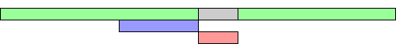

# JavaScript

## script 标签 defer 和 async 的区别

- 相同点：`async` 和 `defer` 下载都不会阻塞 HTML 解析
- 不同点：`async` 下载完成后立即执行，不会等待 HTML 解析完成；`defer` 会等待 HTML 解析完成再执行


**`<script>`**


**`<script async>`**



**`<script defer>`**


## Object.is() 与比较运算符 ==、=== 的区别

- 双等号（`==`）：如果两边的类型不一致，则会进行强制类型转换后再进行比较
- 三等号（`===`）：如果两边的类型不一致时，不会做强制类型转换，直接返回 `false`
- `Object.is()`：一般情况下和三等号的判断相同，只有两个不同点

```js
NaN === NaN; // false
-0 === +0; // true

Object.is(NaN, NaN); // true
Object.is(-0, 0); // false
```

## 判断数组的方式有哪些

`Object.prototype.toString.call()`

```js
Object.prototype.toString.call(obj).slice(8, -1) === "Array";
```

`Array.isArray()`

```js
Array.isArray(obj);
```

`instanceof` / `Array.prototype.isPrototypeOf`

```js
obj instanceof Array;
Array.prototype.isPrototypeOf(obj);
```

## Cookie、SessionStorage 与 LocalStorage 的区别

|                | Cookie                                                                              | SessionStorage                                     | LocalStorage       |
| -------------- | ----------------------------------------------------------------------------------- | -------------------------------------------------- | ------------------ |
| 数据的生命周期 | 一般由服务器生成，可设置失效时间。如果在浏览器端生成 Cookie，默认是关闭浏览器后失效 | 仅在当前会话下有效，关闭页面或浏览器后被清除       | 永久（除非被清除） |
| 存放数据大小   | 4k 左右                                                                             | 一般为 5MB                                         | 同 SessionStorage  |
| 与服务器端通信 | 每次都会携带在 HTTP 头中，如果使用 cookie 保存过多数据会带来性能问题                | 仅在客户端（即浏览器）中保存，不参与和服务器的通信 | 同 SessionStorage  |
